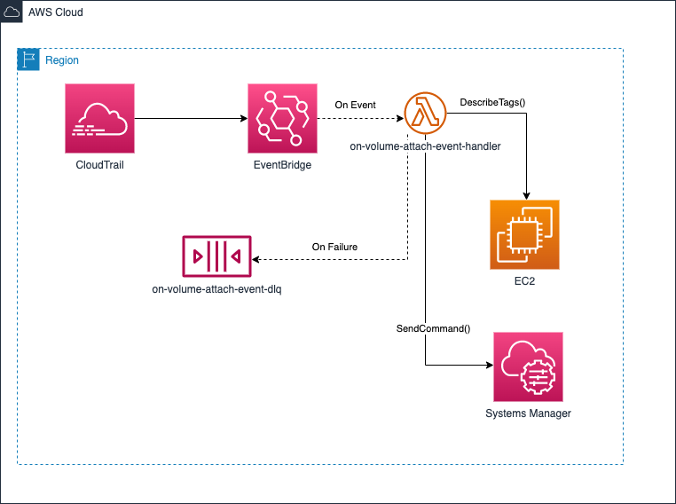

# aws-cdk-drs-agent-installer

## Overview

This project provides a set of examples for installing the [AWS Elastic Disaster Recover](https://aws.amazon.com/disaster-recovery/) agent to EC2 instances within an AWS environment

The project consists of two stacks;

### [drs-agent-installer](./lib/infrastructure/stacks/DrsAgentInstallerStack.ts)
This stack deploys an SSM Association which will run an SSM Document that installs the DRS agent on EC2 instances that match a specified tag. 
The stack also deploys associated roles and an S3 bucket for logging the installation process. 
The EC2 instance role will need to be specified in the stacks ['assumeDrsRolePrincipals'](./bin/app.ts#L32) property so that it has permissions to assume the 'drs-installation-role'.

### check-volumes script
The dr-agent-installer can be configured to install a bash script and cron job on the EC2 instance. 
This script monitors the instance for new volumes being added and initiating a re-installation of the DRS agent to force the new volume to be scanned.  

This approach is a lower cost alternative to the [on-attach-volume-event](#on-attach-volume-event) approach described below but is potentially less robust. The EC2 instance role will also need to be given permissions to invoke the SSM document.

### [on-attach-volume-event](./lib/infrastructure/stacks/OnVolumeAttachEventStack.ts)
When a volumes is attached to an ec2 instance the DRS agent must be reinstalled to force the new volume to be scanned by the agent.

The architecture below is based on ["Tutorial: Triggering a Lambda function with AWS CloudTrail events"](https://docs.aws.amazon.com/lambda/latest/dg/with-cloudtrail-example.html) from the AWS docs.

A trail is configured to write to a specific S3 bucket. 
Create object events on the bucket invoke a lambda function ([cloudtrail-event-notifier](./lib/runtime/cloudtrail-event-notifier.ts)) which looks for a specific CloudTrail event source and type, 
in this case "ec2.amazonaws.com" and "AttachVolume". Matched events are sent to an SNS Topic which invoke another lambda function ([on-volume-attach-event-handler](./lib/runtime/on-volume-attach-event.ts)). 
This function checks that the tags on the EC2 instance match specific tags. If so the lambda invokes the SSM Document to reinstall the drs agent on that specific instance.

The stack can be configured to create a new trail and bucket (which will add additional [cost](https://aws.amazon.com/cloudtrail/pricing/#Pricing)). You can also point at an existing S3 bucket used for storing CloudTrail logs but the lambda will need to have read permissions for this bucket in order to work.

## Deployment

### Prerequisites
* [CDK](https://docs.aws.amazon.com/cdk/v2/guide/getting_started.html#getting_started_install)
* An AWS account with a [CDK bootstrapped environment](https://docs.aws.amazon.com/cdk/v2/guide/getting_started.html#getting_started_bootstrap) 

### Installing the stacks
* `npm run build`
* `cdk synth`
* `cdk -c [trailName|bucket]="<either trail name of new trail or bucket arn of existing cloudtrail bucket>"  deploy --all`

